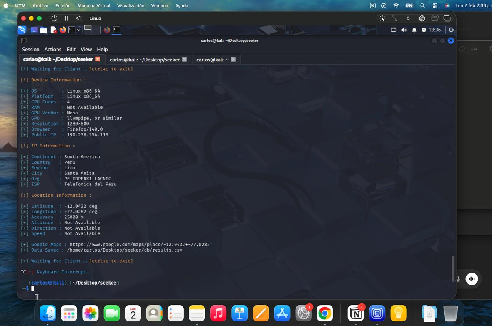

# -Proyecto-de-Hacking-Ético-

Este repositorio documenta un proyecto académico orientado al aprendizaje de principios de **Hacking Ético**, enfocado en el análisis de conexiones y la exposición controlada de servicios en entornos Linux, con fines educativos y de concientización en ciberseguridad.

## Entorno de trabajo
El proyecto fue desarrollado en un sistema operativo Linux, utilizando **Kali Linux** como entorno de laboratorio. Kali Linux es una distribución especializada en seguridad informática, ampliamente utilizada en contextos académicos y profesionales para prácticas de hacking ético y pruebas controladas.

## Uso de ngrok
Como parte del laboratorio, se utilizó una cuenta en la plataforma **ngrok**, herramienta de tunelización que permite exponer servicios locales de forma temporal y segura para fines de prueba.

El uso de ngrok permitió:
- Simular escenarios reales de acceso remoto.
- Analizar conexiones entrantes a un servicio expuesto de manera controlada.
- Observar metadatos básicos asociados a las conexiones.

## Descripción del proyecto
El proyecto consiste en una demostración controlada donde, al acceder a un link abre un doc,la persona al aceptar los permisos,da pie sin que lo sepa a que se pueda saber su dirección exacta,todo se genera con fines de aprendizaje.

Entre los datos observados se incluyen:
- Dirección IP pública
- Tipo de sistema operativo
- Navegador utilizado
- Información geográfica aproximada (país, región o ciudad)

La información de ubicación es estimada y depende de bases de datos públicas, por lo que no representa una localización exacta.

## Objetivos de hacking ético
- Comprender cómo se generan y registran los metadatos de conexión.
- Analizar el alcance y las limitaciones de la información visible en una conexión web.
- Identificar riesgos relacionados con la exposición de servicios.
- Promover la concientización sobre privacidad y seguridad digital.
- Aplicar principios de hacking ético en entornos controlados.

## Consideraciones éticas y legales
- El proyecto tiene fines exclusivamente de aprendizaje
- No se realizan ataques, intrusiones ni accesos no autorizados.
- No se recopila información sensible ni datos personales privados.

## Tecnologías utilizadas
- Linux
- Kali Linux
- Ngrok
- Maquina virtual

## Alcance del proyecto
Este proyecto no tiene como finalidad identificar personas ni realizar seguimiento individual, sino demostrar de manera conceptual cómo funcionan ciertos mecanismos utilizados en pruebas de hacking ético y por qué es importante proteger la información en entornos digitales.

## Evidencia del laboratorio

### Evidencia 2

