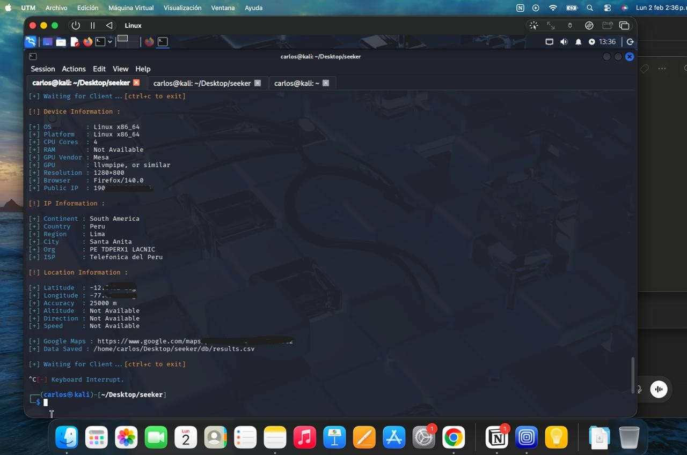

# -Proyecto-de-Hacking-Ético-

## Entorno de trabajo
Este repositorio presenta un análisis educativo sobre los riesgos de seguridad y privacidad asociados al uso indebido de permisos de geolocalización en aplicaciones y sitios web, desde un enfoque de hacking ético y concientización en ciberseguridad.

**¿Por qué se desarollo?

El proyecto se basa en el estudio de una prueba de concepto (PoC) que demuestra cómo un sitio web malicioso puede recolectar información sensible únicamente si el usuario otorga permisos explícitos, resaltando la importancia de no aceptar permisos sin verificar la legitimidad del sitio.

## Herramienta Analizada

La herramienta estudiada es Seeker, un proyecto de código abierto que funciona como prueba de concepto, demostrando qué tipo de información puede ser recolectada por un sitio web si un usuario acepta permisos de ubicación.

Tipo de información que puede exponerse (con consentimiento del usuario):
-Latitud y longitud aproximada
-Información del dispositivo y navegador
-Dirección IP pública
-Datos generales del sistema
📌 Nota: La herramienta no explota vulnerabilidades; depende totalmente de la acción del usuario.

## Descripción del proyecto
El proyecto consiste en una demostración controlada donde, al acceder a un link abre un doc,la persona al aceptar los permisos,da pie sin que lo sepa a que se pueda saber su dirección exacta,todo se genera con fines de aprendizaje.

Entre los datos observados se incluyen:
- Dirección IP pública
- Tipo de sistema operativo
- Navegador utilizado
- Información geográfica aproximada (país, región o ciudad)

La información de ubicación es estimada y depende de bases de datos públicas, por lo que no representa una localización exacta.

## Objetivos de hacking ético
- Comprender cómo se generan y registran los metadatos de conexión.
- Analizar el alcance y las limitaciones de la información visible en una conexión web.
- Identificar riesgos relacionados con la exposición de servicios.
- Promover la concientización sobre privacidad y seguridad digital.
- Aplicar principios de hacking ético en entornos controlados.

## Consideraciones éticas y legales
- El proyecto tiene fines exclusivamente de aprendizaje
- No se realizan ataques, intrusiones ni accesos no autorizados.
- No se recopila información sensible ni datos personales privados.

## Tecnologías utilizadas
- Linux
- Kali Linux
- Ngrok
- Maquina virtual

## Evidencia del laboratorio

### Evidencia 2

👤 Autor

Carlos Andre Hinostroza Altamirano
Repositorio con fines de aprendizaje
